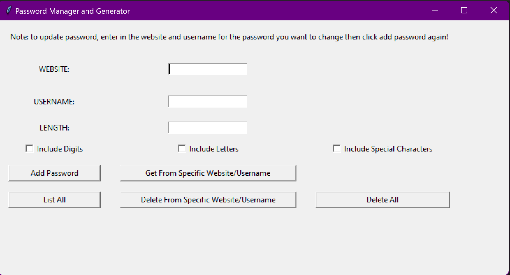

# Password Manager and Generator (For Windows?)

This project is a simple password manager and generator built using Python and Tkinter. It stores the passwords in a .txt file. Additional implementation and changes would focus on making this more secure. 

### Screenshots



### Features
- **Add Password:** Allows users to add passwords for different websites and usernames.
- **Generate Password:** Generates strong passwords based on user-defined criteria.
- **Get Password:** Retrieves passwords based on specified website or username.
- **List All Passwords:** Lists all stored passwords.
- **Delete Password:** Deletes passwords based on specified website or username.
- **Delete All Passwords:** Deletes all stored passwords.

### Installation
1. **Clone the repository:**
3. **Install dependencies:**
   ```bash
   # Ensure you have installed Tkinter (usually comes with Python installation)
   # No additional dependencies are required beyond Python standard library
   ```

### Usage
1. **Run the application:**
   ```bash
   python windowgui.py
   ```

2. **Interface Overview:**
   - **WEBSITE:** Enter the website name.
   - **USERNAME:** Enter the username for the website.
   - **LENGTH:** Specify the length of the password (if generating).
   - **Include Digits, Letters, Special Characters:** Check these options based on the password requirements.

3. **Functionality:**
   - **Add Password:** Adds a new password entry.
   - **Get From Specific Website/Username:** Retrieves passwords based on website or username.
   - **List All:** Displays a list of all stored passwords.
   - **Delete From Specific Website/Username:** Deletes passwords based on website or username.
   - **Delete All:** Deletes all stored passwords.


